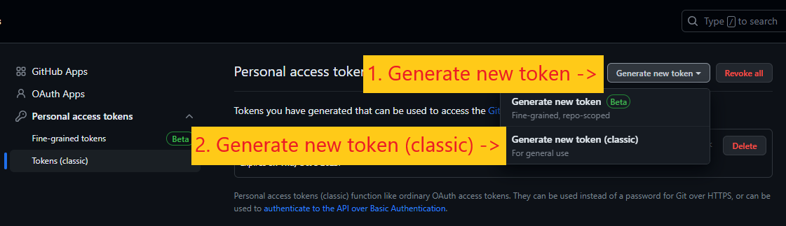
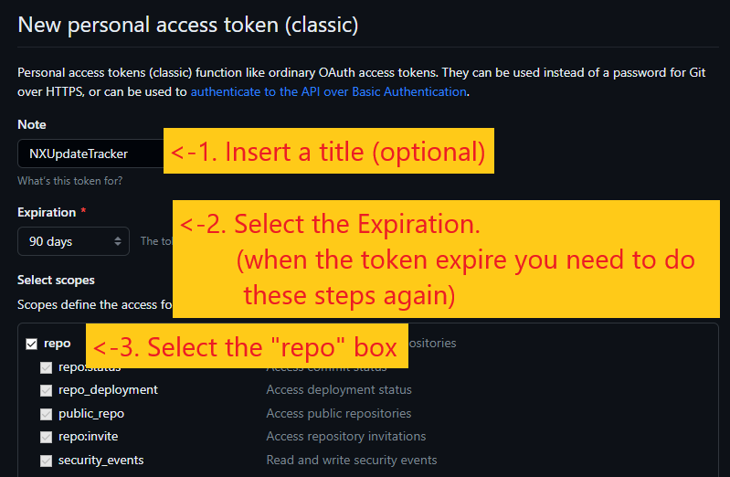
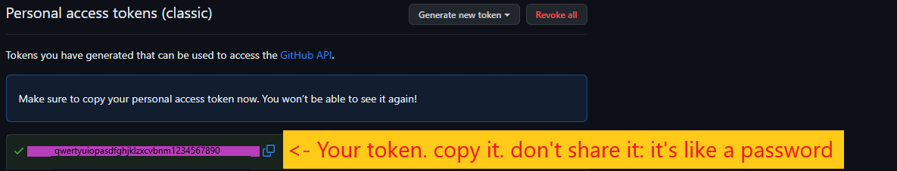

# How to generate a Github API token

- STEP 1: Go [here](https://github.com/settings/tokens)
- STEP 2: Generate a new classic token
  
  
- STEP 3: Select the `repo` scope
  
  
- STEP 4: Generate the token
  
  
- STEP 5: Copy the token (using `CTRL+C` or the blue button to avoid errors)
  
  
